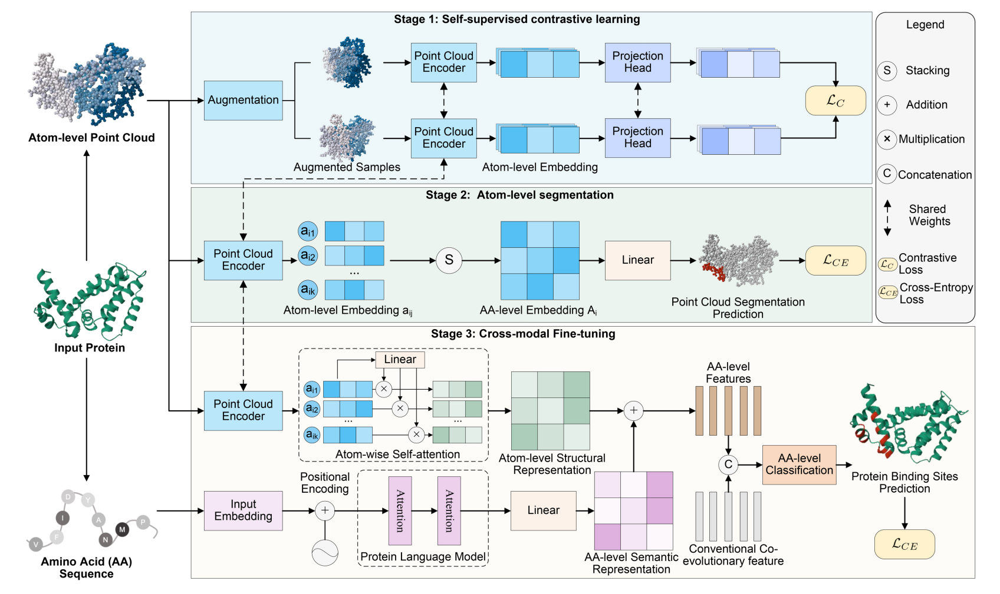

# CrossBind

Official Pytorch implementation of CrossBind: Collaborative Cross-Modal Identification of Protein Nucleic-Acid-Binding Residues.



## Getting Started

### Setup

To set up the environment for CrossBind, follow these steps:

1. **Create Environment:**

    Use `conda` to create a new environment with the dependencies listed in `environment.yaml`.

    ```shell
    conda env create -f environment.yaml
    conda activate Spn_3.7
    ```

2. **Compile SparseConvNet operations:**

    Navigate to the `lib/` directory and compile the SparseConvNet operations.

    ```shell
    cd lib/
    python setup.py develop
    ```

### Data Preparation

To prepare your data for CrossBind, perform the following:

1. **Download Dataset:**

   The dataset containing DNA/RNA PDB files can be downloaded from the following sources:
   
   - GraphBind: [CSBio](http://www.csbio.sjtu.edu.cn/bioinf/GraphBind/)
   - GraphSite: [GitHub - biomed-AI/GraphSite](https://github.com/biomed-AI/GraphSite)

2. **Prepare XYZ Files:**

   To convert original PDB files into XYZ format, you will need to use `LIG_TOOL`.

    ```shell
    git clone https://github.com/realbigws/PDB_Tool.git
    ```

   After cloning the repository, modify the file paths in `datasets/prepare_pdb_to_xyz.py` to match your local setup, then run the script:

    ```shell
    cd datasets/
    python prepare_pdb_to_xyz.py
    ```

### Cross Model

For using pre-trained models and representations:

1. **Load Pre-trained Structure Representation:**

   DNA_127 Structure:

    ```shell
    models/DNA_127_Structure.pkl
    ```

   DNA_181 Test:

    ```shell
    models/Test_181.pkl
    ```

2. **Load ESM2 Representation:**

   For details on loading the ESM2 representation, refer to the documentation available at [GitHub - facebookresearch/esm](https://github.com/facebookresearch/esm).

### Training

To fine-tune the CrossBind model, you can customize the model settings in the configuration files located in `cfgs/*.yaml`. Select the appropriate configuration file for your needs.

- **Run the full version of CrossBind:**

    ```shell
    python CrossBind.py --log_dir SparseConv_default --cfg_file cfgs/SparseConv-Cath-Decoys-Clf-Only.yaml --gpu 0
    ```

### Visualization Case

For visual case studies of the results:

